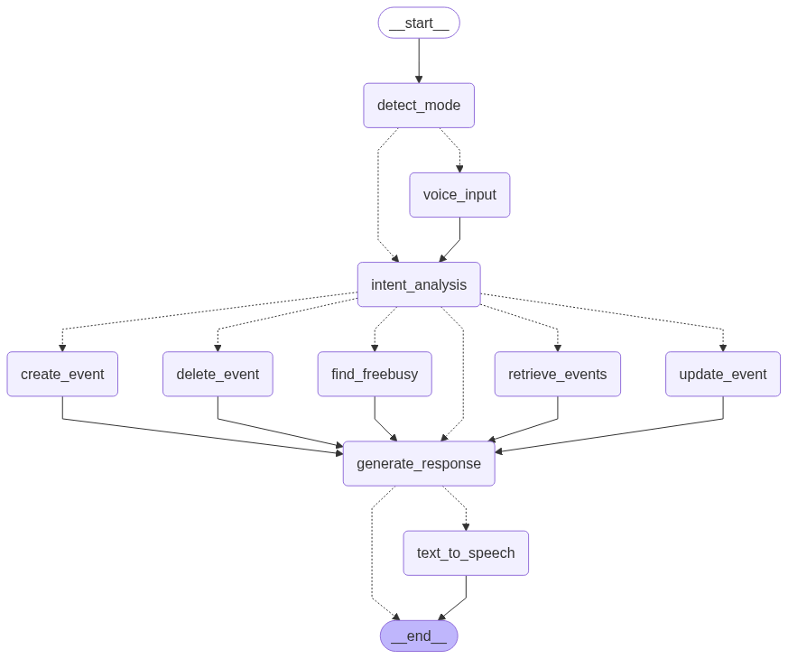

# Mogambo Voice AI Scheduler

## 🌐 Deployed Application
The Mogambo Voice AI Scheduler is currently deployed on the Google Cloud Platform and can be accessed at the following link:

[Deployed App on GCP](https://mogambo-voice-ai-scheduler-124439177573.asia-south2.run.app)

---

## 🚀 Project Vision
Mogambo Voice AI Scheduler is a privacy-first, expert-grade calendar assistant. It combines advanced AI, robust voice recognition, and seamless Google Calendar automation to deliver context-aware scheduling and natural conversation—via both text and voice. Mogambo is engineered for reliability, security, and intelligent automation, making it ideal for top professionals and teams.

- **Voice & Text Input:** Natural interaction with backend voice transcription and secure processing.
- **Google Calendar Automation:** Create, update, retrieve, and delete events with full traceability and security.
- **Intelligent Event Matching:** Automatically suggests event matches (with event IDs and summaries) for ambiguous requests, ensuring precise updates and deletions.
- **Clarification Workflow:** Prompts for missing information, referencing prior context for expert-level conversation.
- **Privacy & Security:** Zero data retention, instant logout on window close, and session isolation.
- **Modern UI:** Responsive, beautiful chat and calendar interface powered by Bootstrap and FullCalendar.

---

## 🛠️ Architecture Overview
- **Backend:** FastAPI, LangGraph, LangChain, Google Calendar API, SpeechRecognition, pydub, gTTS
- **Frontend:** Bootstrap, FullCalendar, custom chat UI, secure session/logout logic
- **Workflow:** Modular agent nodes for intent detection, event CRUD, voice/text handling, and clarification

---

## 🗺️ Workflow Graph


The above image illustrates the overall workflow of the Mogambo Voice AI Scheduler application. It provides a visual representation of how the system processes user inputs, detects intents, routes tasks, and generates responses. This diagram serves as a comprehensive guide to understanding the modular and state-driven architecture of the app.

### Agent Workflow Explanation
The Mogambo agent uses a modular, state-driven workflow powered by LangGraph. Here’s how the workflow operates:

1. **Mode Detection:**  
   The agent first determines if the input is text or voice. If voice, it transcribes the input using SpeechRecognition.

2. **Intent Analysis:**  
   The agent analyzes the user’s request using MistralAI, classifying the intent (e.g., create, update, retrieve, delete event, find free/busy, or general conversation).  
   It merges new information with previous context and asks for clarification if required fields are missing.

3. **Tool Routing:**  
   Based on the detected intent, the workflow routes to the appropriate node:  
   - **Create Event:** Validates and creates a calendar event.  
   - **Retrieve Events:** Fetches events in a specified time range.  
   - **Update Event:** Updates an event, resolving ambiguous references using context and event IDs.  
   - **Delete Event:** Deletes an event, confirming selection if multiple matches are found.  
   - **Find Free/Busy:** Checks calendar availability for a given time range.  
   If the intent is general conversation or clarification, it routes directly to response generation.

4. **Response Generation:**  
   The agent generates a natural language response, referencing context, event IDs, and prior history for traceability.

5. **Text-to-Speech (Voice Mode):**  
   If the session is in voice mode, the response is converted to speech using gTTS and played back to the user.

6. **Conversation History & Context:**  
   All exchanges, event selections, and operations are logged for auditability and compliance.

This workflow ensures robust, context-aware scheduling, expert-level clarification, and seamless voice/text interaction. The modular design allows easy extension for new features and domain-specific automation.

---

## 🧠 Unique Technical Differentiators
- **Autonomous AI Agent:** LangGraph, LangChain, and MistralAI for advanced intent analysis and workflow orchestration.
- **Voice Recognition:** SpeechRecognition, pydub, and gTTS for robust, cross-platform audio handling.
- **Event Traceability:** Every event selection, update, and deletion is logged in the conversation history for auditability.
- **Session Security:** Enforced via FastAPI middleware and frontend scripts—no user data is stored after logout.
- **Expert-Grade Error Handling:** All errors are surfaced with actionable feedback, and the system self-corrects where possible.

---

## 📦 Installation & Setup
1. **Clone the repository:**
   ```sh
   git clone <repo-url>
   cd Mogambo-Voice-AI-Scheduler
   ```
2. **Install dependencies:**
   ```sh
   pip install -r requirements.txt
   ```
   - For Windows: `pip install pyaudio`
   - For Linux: `sudo apt-get install portaudio19-dev python3-pyaudio`
   - For macOS: `brew install portaudio && pip install pyaudio`
3. **Configure Google OAuth:**
   - Create a Google Cloud project and OAuth credentials.
   - Download `credentials.json` and place it in the project root.
   - Set environment variables in `.env`:
     ```env
     GOOGLE_CLIENT_ID=your-client-id
     GOOGLE_CLIENT_SECRET=your-client-secret
     SESSION_SECRET_KEY=your-session-secret
     MISTRAL_API_KEY=your-mistral-apikey
     REDIRECT_URI=http://localhost:8000/auth/callback
     ```
4. **Run the server:**
   ```sh
   uvicorn app:app --reload
   ```
5. **Access the app:**
   - Open [http://localhost:8000](http://localhost:8000) in your browser.

---

## 🗣️ Usage Guide
- **Login:** Authenticate via Google OAuth for secure calendar access.
- **Chat:** Type or speak your requests—"Schedule a meeting tomorrow at 3pm", "Show my events for next week", etc.
- **Voice Mode:** Toggle voice mode in the chat UI, record your message, and let Mogambo handle transcription and intent.
- **Event Selection:** For ambiguous update/delete requests, Mogambo will present possible matches with event IDs and summaries for you to select.
- **Security:** Logout is automatic on window/tab close. No data is retained after session ends.

---

## 🔄 CI/CD Pipeline
The CI/CD pipeline for this application is designed to ensure seamless integration and deployment. The process is as follows:

1. **GitHub Push:**
   - Any changes pushed to the GitHub repository trigger the CI/CD pipeline.

2. **Automated Testing:**
   - The pipeline runs unit and integration tests to validate the changes.

3. **Deployment:**
   - Upon successful testing, the application is automatically deployed to the Google Cloud Platform.

This setup ensures rapid iteration and deployment while maintaining high-quality standards.

---

## 🛠️ Current Status
- **Testing Phase:**
  - The application is currently under testing. Login capabilities are restricted to testers only.

- **Production Approval:**
  - After submission for production approval, the application will undergo a thorough scrutiny process. Deployment to the production environment will be achieved post-approval.

This phased approach ensures that the application meets all quality and security standards before being made available to a broader audience.

---

## 🧩 File Structure
```
Mogambo-Voice-AI-Scheduler/
├── app.py                # FastAPI backend & API routes
├── agent2.py             # Main agent workflow & logic
├── agent.py              # Legacy agent (reference)
├── requirements.txt      # Python dependencies
├── credentials.json      # Google OAuth credentials
├── static/
│   ├── chat.html         # Chat UI & calendar frontend
│   ├── index.html        # Landing page
│   └── ...               # Icons, assets
└── readme.md             # This file
```

---

## 🧪 Testing & Validation
- **Unit & Integration Tests:** Recommended for agent logic and API endpoints.
- **Manual Testing:** Use the chat UI and calendar to validate all workflows.
- **Error Handling:** All errors are surfaced in the UI and logs for rapid debugging.

---

## 🏆 Expert Innovations
- **Context-Aware Clarification:** Mogambo never gets stuck—if info is missing, it asks the right question, referencing prior context.
- **Event ID Traceability:** All event operations are logged with event IDs and summaries for full auditability.
- **Zero Data Retention:** No user data is stored beyond the session. Privacy is guaranteed.
- **Cross-Platform Audio:** Handles OGG, WAV, and WebM formats for maximum compatibility.
- **Modular Agent Design:** Easily extend or customize workflows for advanced use cases.

---

## 🤝 Credits
Created by Waseem M Ansari at WSMAISYS Lab, homeground. Inspired by the best in AI, privacy, and productivity.